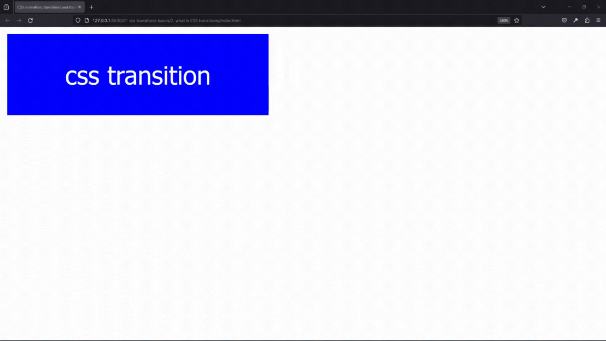
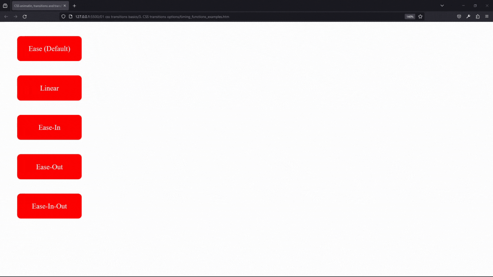
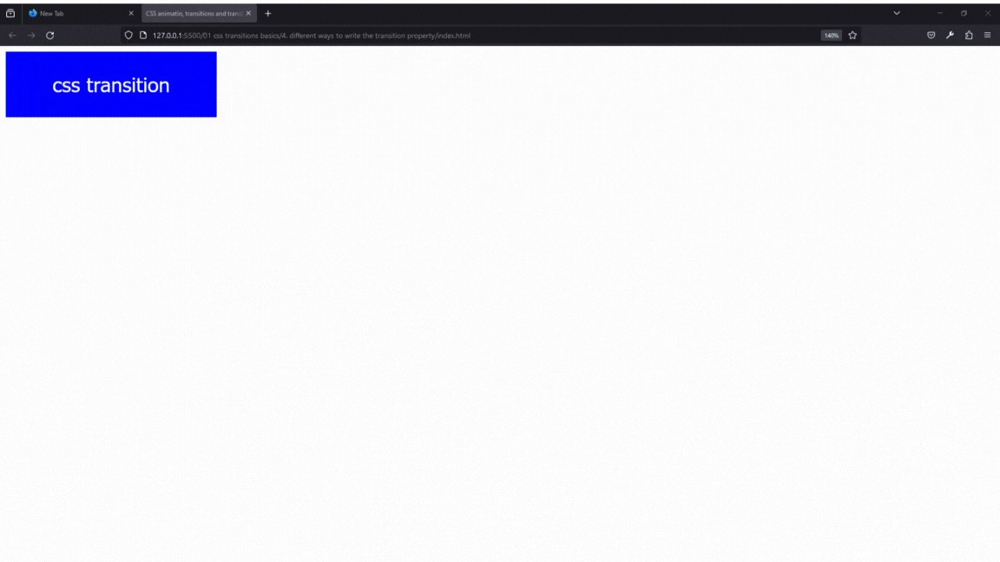

#### 1. [Creative Advanced CSS Animations - Create 100 Projects!](#1)

#### 2. [what is CSS transitions ?](#2)

#### 3. [CSS transitions options](#3)

#### 4. [different ways to write the transition property](#4)

#### 5. [what properties can be transitioned ?](#5)

---

<br>

### 1. Creative Advanced CSS Animations - Create 100 Projects!<a id="1"></a>

<br>

### 2. what is CSS transitions ?<a id="2"></a>

> **_Business Objective: Layout_**



| Technology    | Description     |
| ------------- | --------------- |
| `Language`    | html, css       |
| `Framework`   | -               |
| `Library`     | -               |
| `Text editor` | Vs code         |
| `Browser`     | Chrome, firefox |

---

Transition in css property applied to a specific element to make other properties of this specific element change smoothly over a given duration or animate it in a nice way hovering over

<br>

To define transition we need to steps

1. select any property and set two state, initial & final for hovering effect
1. css **transition-property** that will change from the initial state to the final state
1. the **transition-duration** the amount of time that this change will take to complete

---

<br>

- In index.html

```html
<!DOCTYPE html>
<html lang="en-US">
  <head>
    <meta charset="UTF-8" />
    <meta name="viewport" content="width=device-width, initial-scale=1" />
    <title>CSS animation, transitions and transforms</title>

    <!-- OUR STYLESHEET -->
    <link rel="stylesheet" href="style.css" type="text/css" media="all" />
  </head>

  <body>
    <button>css transition</button>
  </body>
</html>
```

---

- In style.css

```css
/* To define transition we need following steps

0. select any property and set two state, initial & final for hovering effect
1. css **transition-property** that will change from the initial state to the final state
2. the **transition-duration** the amount of time that this change will take to complete */

button {
  height: 90px;
  width: 290px;
  font-size: 28px;
  color: white;
  border: none;
  /* 0️⃣  initial state */
  background-color: blue;

  /* 1️⃣ select property that you want to change*/
  transition-property: background-color;
  /* 2️⃣ set transition from initial state to final state*/
  transition-duration: 3000ms;
}

button:hover {
  /* 0️⃣ final state */
  background-color: green;
}
```

<br>

### 3. CSS transitions options<a id="3"></a>

> **_Business Objective: Layout_**



| Technology    | Description     |
| ------------- | --------------- |
| `Language`    | html, css       |
| `Framework`   | -               |
| `Library`     | -               |
| `Text editor` | Vs code         |
| `Browser`     | Chrome, firefox |

---

<br>

What are transition timing function?


---

- In index.html

```html
<!DOCTYPE html>
<html lang="en-US">
  <head>
    <meta charset="UTF-8" />
    <meta name="viewport" content="width=device-width, initial-scale=1" />
    <title>CSS animatin, transitions and transforms</title>

    <!-- OUR STYLESHEET -->
    <link rel="stylesheet" href="style.css" type="text/css" media="all" />
  </head>

  <body>
    <!-- 1️⃣ parent container -->
    <div class="container">
      <!-- 2️⃣ all are children items, having specific id, with general style move-class -->
      <div id="ease" class="move">Ease (Default)</div>
      <div id="linear" class="move">Linear</div>
      <div id="ease-in" class="move">Ease-In</div>
      <div id="ease-out" class="move">Ease-Out</div>
      <div id="ease-in-out" class="move">Ease-In-Out</div>
    </div>
  </body>
</html>
```

---

- In style.css

```css
.container {
  width: 960px;
}

/* 3️⃣ generic style for all children items */
.move {
  margin: 2em;
  width: 150px;
  height: 50px;
  padding: 10px 15px;
  background-color: red;
  color: #fff;
  line-height: 50px;
  text-align: center;
  border-radius: 0.5em;
  font-size: 20px;

  /* 4️⃣🅰️ select */
  transition-property: translate();
  /* 5️⃣🅱️ time */
  transition-duration: 3s;
}

/* 7️⃣ */
#ease {
  transition-timing-function: ease;
}

/* 7️⃣ */
#linear {
  transition-timing-function: linear;
}

/* 7️⃣ */
#ease-in {
  transition-timing-function: ease-in;
}

/* 7️⃣ */
#ease-out {
  transition-timing-function: ease-out;
}

/* 7️⃣ */
#ease-in-out {
  transition-timing-function: ease-in-out;
}

/* 6️⃣ the final state */
.move:hover {
  /* move 900px horizontal i.e X-axis;  0px vertical i.e Y-axis, do nothing */
  transform: translate(900px, 0);
}
```

---

We are saying to the browser, when I hover over any div, I want it to move 900px to the right and I want this change or this movement to happen smoothly over three seconds and I want each div to move differently.

<br>

### 4. different ways to write the transition property<a id="4"></a>

> **_Business Objective: Layout_**



| Technology    | Description     |
| ------------- | --------------- |
| `Language`    | html, css       |
| `Framework`   | -               |
| `Library`     | -               |
| `Text editor` | Vs code         |
| `Browser`     | Chrome, firefox |

---

What is transition delay


<br>

- In index.html

```html
<!DOCTYPE html>
<html lang="en-US">
  <head>
    <meta charset="UTF-8" />
    <meta name="viewport" content="width=device-width, initial-scale=1" />
    <title>CSS animatin, transitions and transforms</title>

    <!-- OUR STYLESHEET -->
    <link rel="stylesheet" href="style.css" type="text/css" media="all" />
  </head>

  <body>
    <button>css transition</button>
  </body>
</html>
```

---

- In style.css

```css
button {
  height: 90px;
  width: 290px;
  font-size: 28px;
  color: white;
  border: none;
  background-color: blue;

  /* 1️⃣ How to select specific multiple property */
  /* transition-property: background-color color width;
  transition-duration:1s */

  /* 2️⃣  How to select a lot of property more than five or all*/
  /* transition-property: all;
  transition-duration:1s */

  /* How to do transition from one property to another one by one */
  /* 3️⃣ shorthand takes four args */
  /* 🟢select-property 🟢duration 🟢transition-timing-function 🟢transition-delay */
  /* transition: background-color 3s ease-in-out 1s, color 2s ease 4s,
    border-radius 4s ease-out 6s; */

  /* How to transition all property at same time */
  /* 4️⃣ shorthand takes four args*/
  /* 🟢select-property 🟢duration 🟢transition-timing-function 🟢transition-delay */
  transition: all 3s ease-in 2s;
}

button:hover {
  background-color: green;
  color: black;
  border-radius: 50%;
}
```

<br>

### 5. what properties can be transitioned ?<a id="5"></a>

> **_Business Objective: Layout_**


| Technology    | Description     |
| ------------- | --------------- |
| `Language`    | html, css       |
| `Framework`   | -               |
| `Library`     | -               |
| `Text editor` | Vs code         |
| `Browser`     | Chrome, firefox |

---

- In index.html

```html
<!DOCTYPE html>
<html lang="en-US">
  <head>
    <meta charset="UTF-8" />
    <meta name="viewport" content="width=device-width, initial-scale=1" />
    <title>CSS animatin, transitions and transforms</title>

    <!-- OUR STYLESHEET -->
    <link rel="stylesheet" href="style.css" type="text/css" media="all" />
  </head>

  <body>
    <div class="background">background</div>
    <div class="color">color</div>
    <div class="font-size">font-size</div>
    <div class="height">height</div>
    <div class="width">width</div>
    <div class="letter-spacing">letter-spacing</div>
    <div class="line-height">line-height</div>
    <div class="margin-top">margin-top</div>
    <div class="margin-bottom">margin-bottom</div>
    <div class="opacity">opacity</div>
    <div class="padding">padding</div>
    <div class="border-color">border-color</div>
    <div class="border-width">border-width</div>
  </body>
</html>
```

---

- In style.css

```css
/* generic style for all div */
div {
  height: 90px;
  width: 290px;
  font-size: 28px;
  margin: 20px;
  color: white;
  border: none;
  background-color: blue;
  line-height: 90px;
  text-align: center;

  /* 1️⃣ shorthand: 🟢select 🟢duration */
  transition: all 1s;
}

.background:hover {
  background-color: green;
}

.color:hover {
  color: red;
}

.font-size:hover {
  font-size: 32px;
}

.height:hover {
  height: 120px;
}

.width:hover {
  width: 340px;
}

.letter-spacing:hover {
  letter-spacing: 5px;
}

.line-height:hover {
  line-height: 120px;
}

.margin-bottom:hover {
  margin-bottom: 50px;
}

.margin-top:hover {
  margin-top: 50px;
}

.opacity:hover {
  opacity: 0.3;
}

.padding:hover {
  padding: 20px;
}

.border-color,
.border-width {
  border: 6px solid green;
}

.border-color:hover {
  border-color: red;
}

.border-width:hover {
  border-width: 12px;
}
```

<br>
