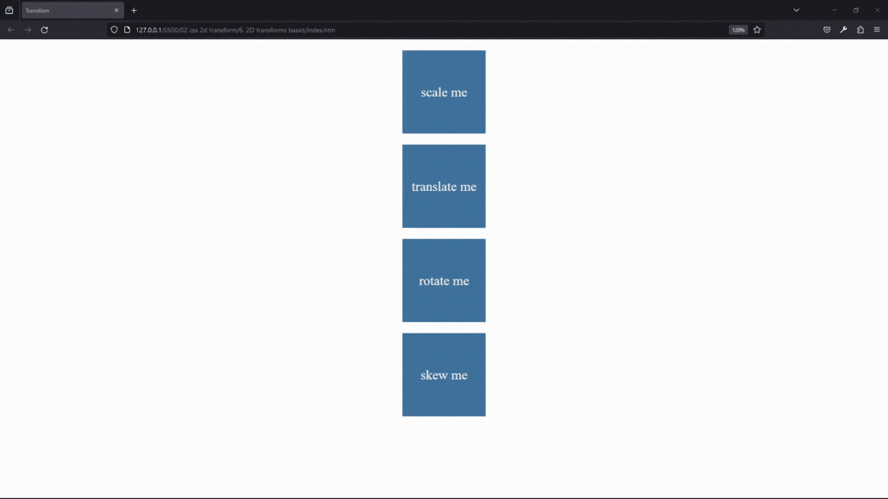
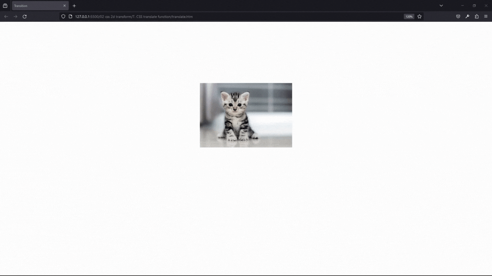
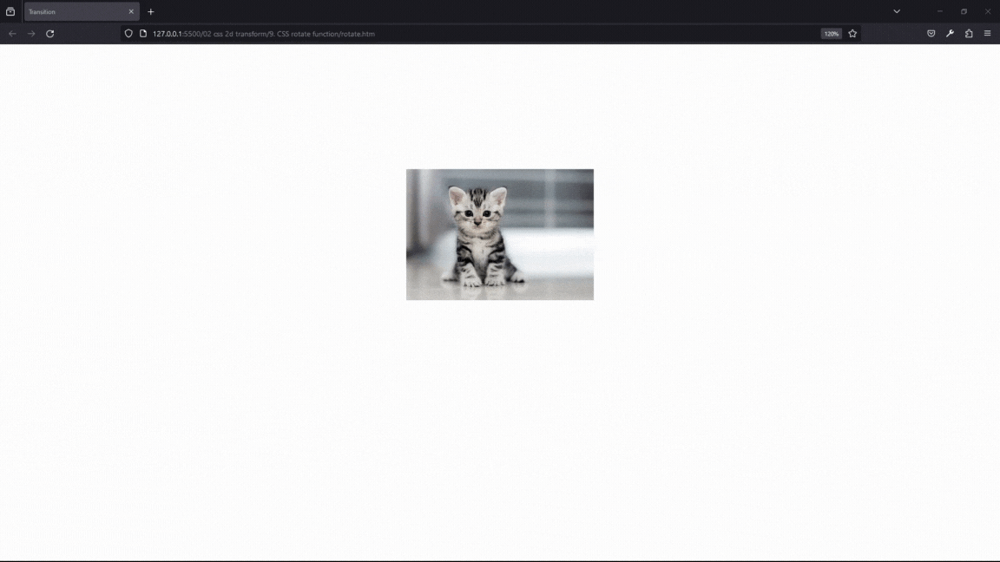
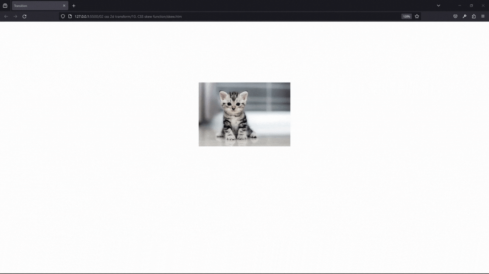
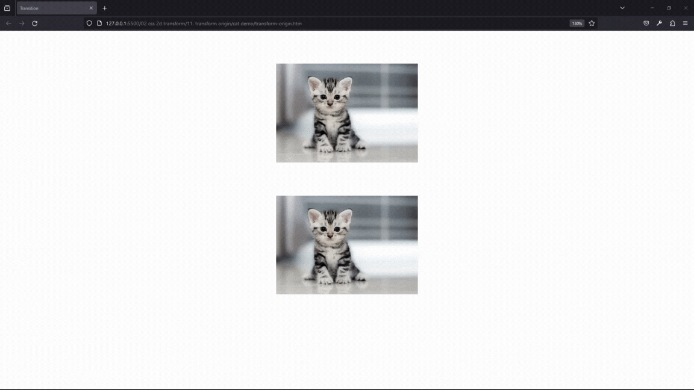
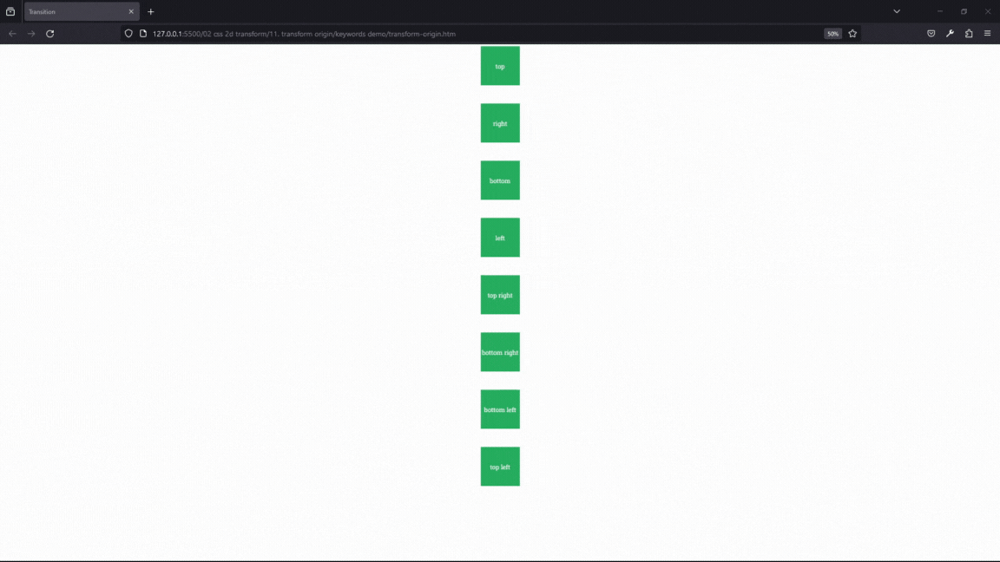
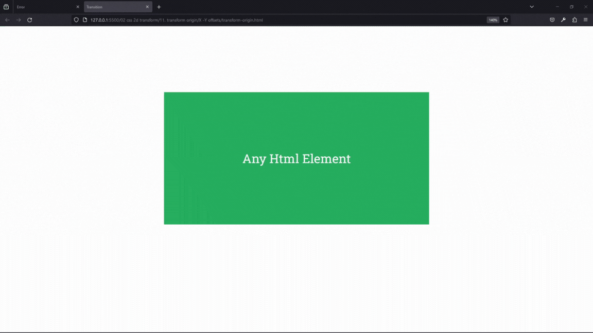

#### 6. [2D transforms basics](#6)

#### 7. [CSS translate function](#7)

#### 8. [CSS scale function](#8)

#### 9. [CSS rotate function](#9)

#### 10.[ CSS skew function](#10)

#### 11.[ transform origin](#11)

---

<br>

### 6. 2D transforms basics<a id="6"></a>

> **_Business Objective: Layout_**



| Technology    | Description     |
| ------------- | --------------- |
| `Language`    | html, css       |
| `Framework`   | -               |
| `Library`     | -               |
| `Text editor` | Vs code         |
| `Browser`     | Chrome, firefox |

---

- In index.html

```html
<!DOCTYPE html>
<html>
  <head>
    <meta charset="UTF-8" />
    <title>Transition</title>
    <style type="text/css">
      div {
        height: 150px;
        width: 150px;
        background-color: #40739e;
        color: white;
        line-height: 150px;
        text-align: center;
        font-size: 24px;
        margin: 20px;
        margin-right: auto;
        margin-left: auto;
        transition: transform 1s;
      }

      .scale:hover {
        transform: scale(1.2);
      }

      .translate:hover {
        transform: translateX(320px);
      }

      .rotate:hover {
        transform: rotate(180deg);
      }

      .skew:hover {
        transform: skew(20deg);
      }
    </style>
  </head>

  <body>
    <div class="scale">scale me</div>
    <div class="translate">translate me</div>
    <div class="rotate">rotate me</div>
    <div class="skew">skew me</div>
  </body>
</html>
```

<br>

### 7. CSS translate function<a id="7"></a>

> **_Business Objective: Layout_**



| Technology    | Description     |
| ------------- | --------------- |
| `Language`    | html, css       |
| `Framework`   | -               |
| `Library`     | -               |
| `Text editor` | Vs code         |
| `Browser`     | Chrome, firefox |

---

- In index.html

```html
<!DOCTYPE html>
<html>
  <head>
    <meta charset="UTF-8" />
    <title>Transition</title>
    <style type="text/css">
      img {
        width: 300px;
        display: block;
        margin: auto;
        margin-top: 200px;
        transition: transform 2s;
      }

      img:hover {
        transform: translate(-500px, 200px);
      }
    </style>
  </head>

  <body>
    
  </body>
</html>

<!-- 

transfrom: translate(the value);

transform: translate(10px, 10px)

 -->
```

<br>

### 8. CSS scale function<a id="8"></a>

> **_Business Objective: Layout_**


| Technology    | Description     |
| ------------- | --------------- |
| `Language`    | html, css       |
| `Framework`   | -               |
| `Library`     | -               |
| `Text editor` | Vs code         |
| `Browser`     | Chrome, firefox |

---

- In index.html

```html
<!DOCTYPE html>
<html>
  <head>
    <meta charset="UTF-8" />
    <title>Transition</title>
    <style type="text/css">
      img {
        width: 300px;
        display: block;
        margin: auto;
        margin-top: 200px;
        transition: transform 2s;
      }

      img:hover {
        transform: scale(2);
      }
    </style>
  </head>

  <body>
    
  </body>
</html>
```

---

<br>

### 9. CSS rotate function<a id="9"></a>

> **_Business Objective: Layout_**



| Technology    | Description     |
| ------------- | --------------- |
| `Language`    | html, css       |
| `Framework`   | -               |
| `Library`     | -               |
| `Text editor` | Vs code         |
| `Browser`     | Chrome, firefox |

---

- In index.html

```html
<!DOCTYPE html>
<html>
  <head>
    <meta charset="UTF-8" />
    <title>Transition</title>
    <style type="text/css">
      img {
        width: 300px;
        display: block;
        margin: auto;
        margin-top: 200px;
        transition: transform 2s;
      }

      img:hover {
        transform: rotate(200grad);
      }
    </style>
  </head>

  <body>
    
  </body>
</html>
```

<br>

### 10. CSS skew function<a id="10"></a>

> **_Business Objective: Layout_**



| Technology    | Description     |
| ------------- | --------------- |
| `Language`    | html, css       |
| `Framework`   | -               |
| `Library`     | -               |
| `Text editor` | Vs code         |
| `Browser`     | Chrome, firefox |

---

- In index.html

```html
<!DOCTYPE html>
<html>
  <head>
    <meta charset="UTF-8" />
    <title>Transition</title>
    <style type="text/css">
      img {
        width: 300px;
        display: block;
        margin: auto;
        margin-top: 200px;
        transition: transform 2s;
      }

      img:hover {
        transform: skew(20deg, 40deg);
      }
    </style>
  </head>

  <body>
    
  </body>
</html>
```

<br>

### 11. transform origin<a id="11"></a>

> **_Business Objective: Layout_**

CAT DEMO



| Technology    | Description     |
| ------------- | --------------- |
| `Language`    | html, css       |
| `Framework`   | -               |
| `Library`     | -               |
| `Text editor` | Vs code         |
| `Browser`     | Chrome, firefox |

---

- In index.html

```html
<!DOCTYPE html>
<html>
  <head>
    <meta charset="UTF-8" />
    <title>Transition</title>
    <style type="text/css">
      img {
        width: 300px;
        display: block;
        margin: auto;
        margin-bottom: 70px;
        margin-top: 70px;
        transition: transform 1s;
      }

      .second {
        transform-origin: top left;
        margin-bottom: 0;
      }

      .first:hover,
      .second:hover {
        transform: rotate(30deg);
      }
    </style>
  </head>

  <body>
    
    
  </body>
</html>
```

---

> **_Business Objective: Layout_**



KEYWORD DEMO

| Technology    | Description     |
| ------------- | --------------- |
| `Language`    | html, css       |
| `Framework`   | -               |
| `Library`     | -               |
| `Text editor` | Vs code         |
| `Browser`     | Chrome, firefox |

---

- In index.html

```html
<!DOCTYPE html>
<html>
  <head>
    <meta charset="UTF-8" />
    <title>Transition</title>
    <link
      href="https://fonts.googleapis.com/css?family=Roboto+Slab"
      rel="stylesheet"
    />
    <style type="text/css">
      div {
        width: 150px;
        height: 150px;
        background-color: #27ae60;
        display: block;
        margin: auto;
        margin-bottom: 70px;
        color: white;
        font-size: 24px;
        font-family: "Roboto Slab", serif;
        text-align: center;
        line-height: 150px;
        transition: transform 1s;
      }

      div:hover {
        transform: rotate(45deg);
      }

      .top {
        transform-origin: top;
      }

      .right {
        transform-origin: right;
      }

      .left {
        transform-origin: left;
      }

      .bottom {
        transform-origin: bottom;
      }

      .top-right {
        transform-origin: top right;
      }

      .top-left {
        transform-origin: top left;
      }

      .bottom-right {
        transform-origin: bottom right;
      }

      .bottom-left {
        transform-origin: bottom left;
      }
    </style>
  </head>

  <body>
    <div class="top">top</div>
    <div class="right">right</div>
    <div class="bottom">bottom</div>
    <div class="left">left</div>
    <div class="top-right">top right</div>
    <div class="bottom-right">bottom right</div>
    <div class="bottom-left">bottom left</div>
    <div class="top-left">top left</div>
  </body>
</html>
```

---

> **_Business Objective: Layout_**

X & Y OFFSETS



| Technology    | Description     |
| ------------- | --------------- |
| `Language`    | html, css       |
| `Framework`   | -               |
| `Library`     | -               |
| `Text editor` | Vs code         |
| `Browser`     | Chrome, firefox |

---

- In index.html

```html
<!DOCTYPE html>
<html>
  <head>
    <meta charset="UTF-8" />
    <title>Transition</title>
    <link
      href="https://fonts.googleapis.com/css?family=Roboto+Slab"
      rel="stylesheet"
    />
    <style type="text/css">
      div {
        width: 600px;
        height: 300px;
        background-color: #27ae60;
        display: block;
        margin: auto;
        margin-top: 150px;
        color: white;
        font-size: 28px;
        text-transform: capitalize;
        font-family: "Roboto Slab", serif;
        text-align: center;
        line-height: 300px;
        transition: transform 1s;
        transform-origin: 300px 150;
      }

      div:hover {
        transform: rotate(45deg);
      }
    </style>
  </head>

  <body>
    <div class="top">any html element</div>
  </body>
</html>
```

<br>
