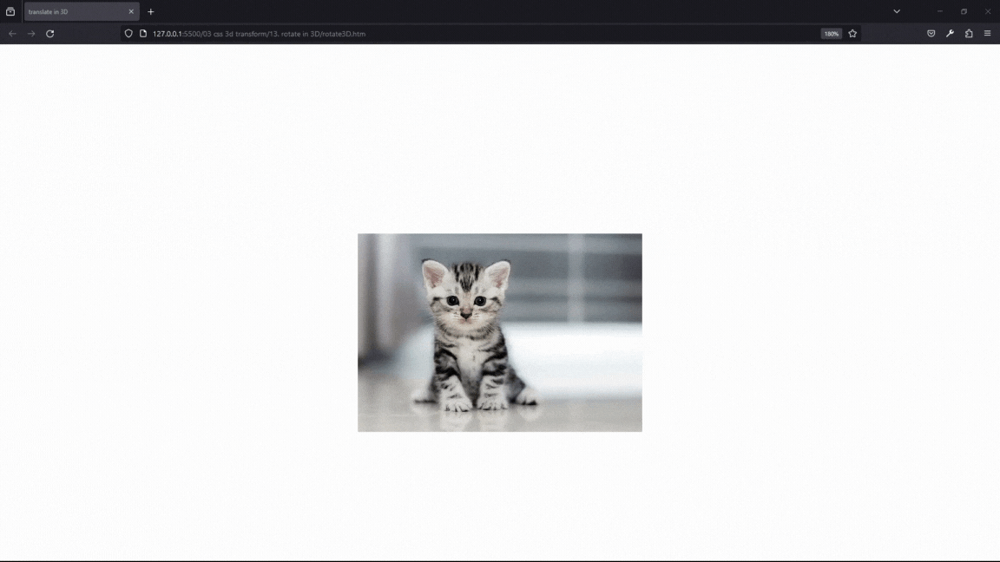
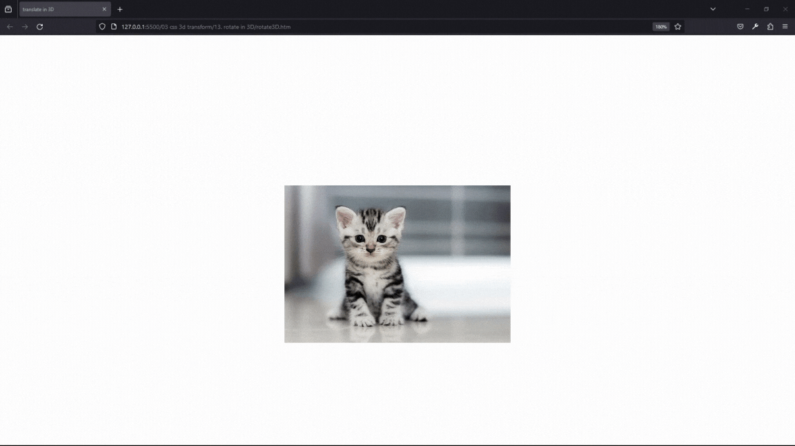

#### 12. [translate in 3D](#12)

#### 13. [rotate in 3D](#13)

---

<br>

### 12. translate in 3D<a id="12"></a>

> **_Business Objective: Layout_**


| Technology    | Description     |
| ------------- | --------------- |
| `Language`    | html, css       |
| `Framework`   | -               |
| `Library`     | -               |
| `Text editor` | Vs code         |
| `Browser`     | Chrome, firefox |

---

- In index.html

```html
<!DOCTYPE html>
<html>
  <head>
    <meta charset="UTF-8" />
    <title>translate in 3D</title>
    <style type="text/css">
      body {
        /* 1️⃣ define/create perspective first for 3d in 👫parent container */
        /* perspective is the distance b/w my eyes and computer screen */
        perspective: 800px;
      }

      img {
        width: 300px;
        display: block;
        margin: auto;
        margin-top: 200px;
        /* 2️⃣ setup */
        transition: transform 1s;
      }

      img:hover {
        /* 3️⃣  image move towards us  */
        /* transform: translateZ(300px); */

        /* image move away from my eye to computer */
        transform: translateZ(-300px);
      }
    </style>
  </head>

  <body>
    
  </body>
</html>
```

<br>

### 13. rotate in 3D<a id="13"></a>

> **_Business Objective: Layout_**

> X-axis



---

> Y-axis


---

> Z-axis



| Technology    | Description     |
| ------------- | --------------- |
| `Language`    | html, css       |
| `Framework`   | -               |
| `Library`     | -               |
| `Text editor` | Vs code         |
| `Browser`     | Chrome, firefox |

---

- In index.html

```html
<!DOCTYPE html>
<html>
  <head>
    <meta charset="UTF-8" />
    <title>translate in 3D</title>
    <style type="text/css">
      body {
        /* 1️⃣ define/create perspective first for 3d in 👫parent container */
        /* perspective is the distance b/w my eyes and computer screen */
        perspective: 500px;
      }

      img {
        width: 300px;
        display: block;
        margin: auto;
        margin-top: 200px;
        /* 2️⃣ setup */
        transition: transform 1s;
      }

      img:hover {
        /* 3️⃣  rotate image   */
        transform: rotateX(60deg);
        transform: rotateY(60deg);
        transform: rotateZ(60deg);
      }
    </style>
  </head>

  <body>
    
  </body>
</html>
```

<br>
