| Index                                                                | Index                                                   |
| -------------------------------------------------------------------- | ------------------------------------------------------- |
| 14. [creative buttons effects using CSS transforms](#14)             | 27. [creative button hover effect](#27)                 |
| 15. [creative rotating button effect](#15)                           | 28. [creative splitted button effect](#28)              |
| 16. [creative swipe button effect](#16)                              | 29. [creative border swapping button effect](#29)       |
| 17. [creative button hover effect](#17)                              | 30. [creative border growing button effect](#30)        |
| 18. [creative button stretching effect](#18)                         | 31. [creative first letter rotating button effect](#31) |
| 19. [creative button swipe effect from top to bottom with text](#19) | 32. [creative 4 borders growing button effect](#32)     |
| 20. [creative button glowing effect](#20)                            | 33. [creative wavy button effect](#33)                  |
| 21. [creative two layers swapping button effect](#21)                | 34. [creative 2 cuts button effect](#34)                |
| 22. [creative text scaling button effect](#22)                       | 35. [creative 2 parts skewed button effect](#35)        |
| 23. [creative circular swapping button effect](#23)                  | 36. [creative pulsing button effect](#36)               |
| 24. [creative rotating 3 layers button effect](#24)                  | 37. [diagonal swipe button effect using borders](#37)   |
| 25. [creative layers swapping from left to right button effect](#25) | 38. [Creative 4 Lines Button Hover Effect](#38)         |
| 26. [creative 3 circles to background button effect](#26)            |

---

<br>

### 14. creative buttons effects using CSS transforms<a id="14"></a>

> **_Business Objective: Layout_**


| Technology    | Description     |
| ------------- | --------------- |
| `Language`    | html, css       |
| `Framework`   | -               |
| `Library`     | -               |
| `Text editor` | Vs code         |
| `Browser`     | Chrome, firefox |

---

<br>

### 15. creative rotating button effect<a id="15"></a>

> **_Business Objective: Layout_**

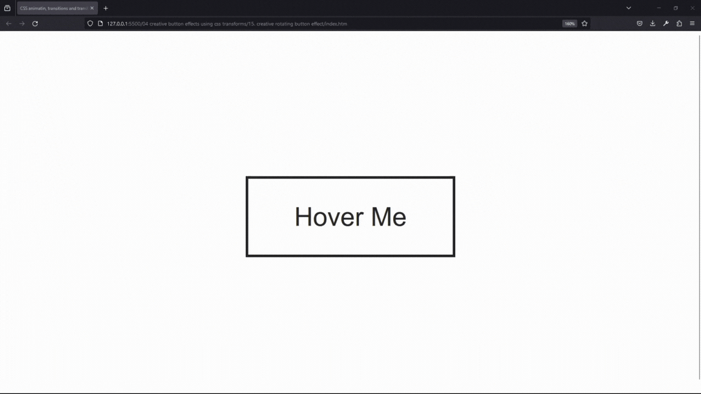

| Technology    | Description     |
| ------------- | --------------- |
| `Language`    | html, css       |
| `Framework`   | -               |
| `Library`     | -               |
| `Text editor` | Vs code         |
| `Browser`     | Chrome, firefox |

---

- In index.html

```html
<!DOCTYPE html>
<html lang="en-US">
  <head>
    <meta charset="UTF-8" />
    <meta name="viewport" content="width=device-width, initial-scale=1" />
    <title>CSS animatin, transitions and transforms</title>

    <!-- OUR STYLESHEET -->
    <link rel="stylesheet" href="style.css" type="text/css" media="all" />
  </head>

  <body>
    <a href="#">Hover Me</a>
  </body>
</html>
```

---

- In style.css

```css
body {
  height: 100vh;
  display: flex;
  justify-content: center;
  align-items: center;
}

a {
  text-decoration: none;
  color: #262626;
  font-family: sans-serif;
  font-size: 45px;
  border: 5px solid #262626;
  padding: 40px 80px;
  position: relative;
  overflow: hidden;
}

a:before {
  content: "";
  position: absolute;
  left: 0;
  top: 0;
  background-color: #fff200;
  height: 100%;
  width: 100%;
  z-index: -1;
  transform-origin: bottom left;
  transform: rotate(-90deg);
  transition: transform 1s;
}

a:hover:before {
  transform: rotate(0deg);
}
```

<br>

### 16. creative swipe button effect<a id="16"></a>

> **_Business Objective: Layout_**

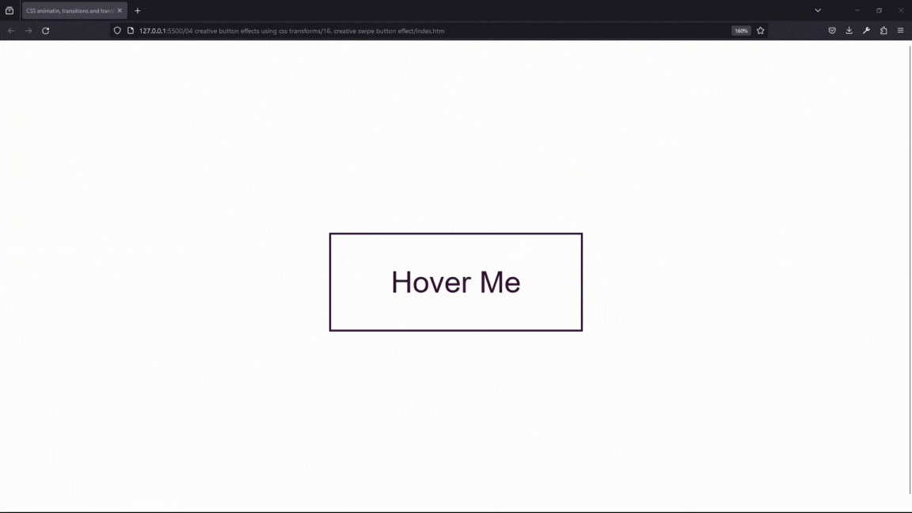

| Technology    | Description     |
| ------------- | --------------- |
| `Language`    | html, css       |
| `Framework`   | -               |
| `Library`     | -               |
| `Text editor` | Vs code         |
| `Browser`     | Chrome, firefox |

---

- In index.html

```html
<!DOCTYPE html>
<html lang="en-US">
  <head>
    <meta charset="UTF-8" />
    <meta name="viewport" content="width=device-width, initial-scale=1" />
    <title>CSS animatin, transitions and transforms</title>

    <!-- OUR STYLESHEET -->
    <link rel="stylesheet" href="style.css" type="text/css" media="all" />
  </head>

  <body>
    <a href="#">Hover Me</a>
  </body>
</html>
```

---

- In style.css

```css
body {
  height: 100vh;
  display: flex;
  justify-content: center;
  align-items: center;
}

a {
  text-decoration: none;
  color: #262626;
  font-family: sans-serif;
  font-size: 45px;
  border: 5px solid #262626;
  padding: 40px 80px;
  position: relative;
  overflow: hidden;
}

a:before {
  content: "";
  position: absolute;
  left: 0;
  top: 0;
  background-color: #fff200;
  height: 100%;
  width: 100%;
  z-index: -1;
  transform-origin: bottom left;
  transform: rotate(-90deg);
  transition: transform 1s;
}

a:hover:before {
  transform: rotate(0deg);
}
```

<br>

### 17. creative button hover effect<a id="17"></a>

> **_Business Objective: Layout_**


| Technology    | Description     |
| ------------- | --------------- |
| `Language`    | html, css       |
| `Framework`   | -               |
| `Library`     | -               |
| `Text editor` | Vs code         |
| `Browser`     | Chrome, firefox |

---

- In index.html

```html
<!DOCTYPE html>
<html lang="en-US">
  <head>
    <meta charset="UTF-8" />
    <meta name="viewport" content="width=device-width, initial-scale=1" />
    <title>CSS animatin, transitions and transforms</title>

    <!-- OUR STYLESHEET -->
    <link rel="stylesheet" href="style.css" type="text/css" media="all" />
  </head>

  <body>
    <a href="#">hover me</a>
  </body>
</html>
```

---

- In style.css

```css
body {
  height: 100vh;
  display: flex;
  align-items: center;
  justify-content: center;
}

a {
  padding: 40px 80px;
  font-family: sans-serif;
  text-decoration: none;
  color: #262626;
  font-size: 45px;
  letter-spacing: 2px;
  border: 5px solid #262626;
  position: relative;
  transition: 1s;
}

a:before {
  content: "";
  position: absolute;
  top: 0;
  left: 0;
  width: 100%;
  height: 100%;
  background-color: #262626;
  transition: 1s;
  transform: rotateX(90deg);
  z-index: -1;
}

a:after {
  content: "";
  position: absolute;
  top: 0;
  left: 0;
  width: 100%;
  height: 100%;
  background-color: #262626;
  transition: 1s;
  transform: rotateY(90deg);
  z-index: -1;
}

a:hover:before {
  transform: rotateX(0);
}

a:hover:after {
  transform: rotateY(0);
}

a:hover {
  color: white;
}
```

<br>

### 18. creative button stretching effect<a id="18"></a>

> **_Business Objective: Layout_**


| Technology    | Description     |
| ------------- | --------------- |
| `Language`    | html, css       |
| `Framework`   | -               |
| `Library`     | -               |
| `Text editor` | Vs code         |
| `Browser`     | Chrome, firefox |

---

- In index.html

```html
<!DOCTYPE html>
<html lang="en-US">
  <head>
    <meta charset="UTF-8" />
    <meta name="viewport" content="width=device-width, initial-scale=1" />
    <title>CSS animatin, transitions and transforms</title>

    <!-- GOOGLE FONTS -->
    <link
      href="https://fonts.googleapis.com/css?family=Roboto:100,300,400,900"
      rel="stylesheet"
    />

    <!-- OUR STYLESHEET -->
    <link rel="stylesheet" href="style.css" type="text/css" media="all" />
  </head>

  <body>
    <a href="#">button</a>
  </body>
</html>
```

---

- In style.css

```css
body {
  height: 100vh;
  display: flex;
  justify-content: center;
  align-items: center;
}

a {
  text-decoration: none;
  padding: 40px 80px;
  color: #e1332d;
  border: 3px solid #e1332d;
  text-transform: uppercase;
  font-size: 40px;
  font-family: "roboto";
  font-weight: 300;
  letter-spacing: -2px;
  transition: all 0.5s;
}

a:hover {
  font-weight: 900;
  letter-spacing: 10px;
  border: 7px solid #e1332d;
}
```

<br>

### 19. creative button swipe effect from top to bottom with text<a id="19"></a>

> **_Business Objective: Layout_**


| Technology    | Description     |
| ------------- | --------------- |
| `Language`    | html, css       |
| `Framework`   | -               |
| `Library`     | -               |
| `Text editor` | Vs code         |
| `Browser`     | Chrome, firefox |

---

- In index.html

```html
<!DOCTYPE html>
<html lang="en-US">
  <head>
    <meta charset="UTF-8" />
    <meta name="viewport" content="width=device-width, initial-scale=1" />
    <title>CSS animatin, transitions and transforms</title>

    <!-- OUR STYLESHEET -->
    <link rel="stylesheet" href="style.css" type="text/css" media="all" />
  </head>

  <body>
    <a href="#">Hover Me</a>
  </body>
</html>
```

---

- In style.css

```css
body {
  height: 100vh;
  display: flex;
  justify-content: center;
  align-items: center;
  background-color: #222;
}

a {
  text-decoration: none;
  color: white;
  font-family: sans-serif;
  font-size: 40px;
  border: 3px solid white;
  padding: 40px 80px;
  position: relative;
  transition: all 1s;
  overflow: hidden;
}

a:before {
  content: "YEAH!";
  color: white;
  background-color: #f44336;
  display: flex;
  align-items: center;
  justify-content: center;
  position: absolute;
  left: 0;
  top: 0;
  height: 100%;
  width: 100%;
  transform: translateY(-100%);
  transition: all 0.5s;
}

a:hover:before {
  transform: translateY(0);
}
```

<br>

### 20. creative button glowing effect<a id="20"></a>

> **_Business Objective: Layout_**

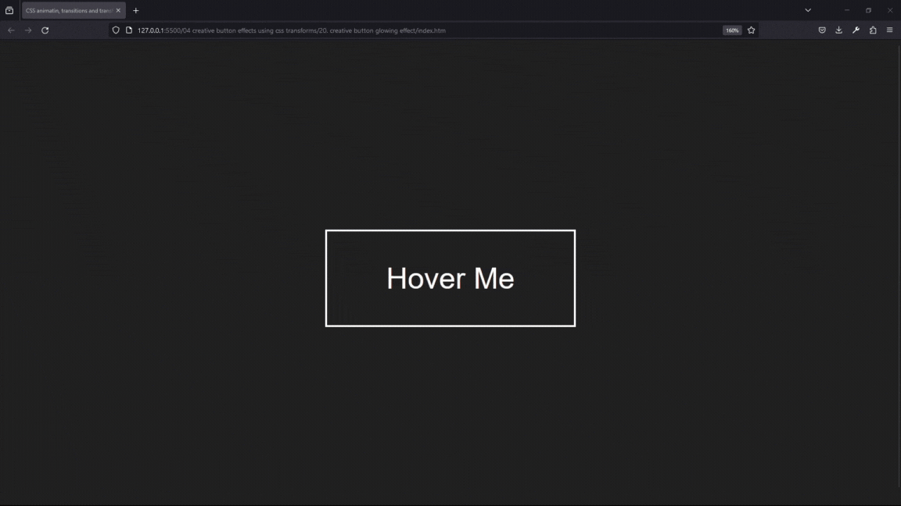

| Technology    | Description     |
| ------------- | --------------- |
| `Language`    | html, css       |
| `Framework`   | -               |
| `Library`     | -               |
| `Text editor` | Vs code         |
| `Browser`     | Chrome, firefox |

---

- In index.html

```html
<!DOCTYPE html>
<html lang="en-US">
  <head>
    <meta charset="UTF-8" />
    <meta name="viewport" content="width=device-width, initial-scale=1" />
    <title>CSS animatin, transitions and transforms</title>

    <!-- OUR STYLESHEET -->
    <link rel="stylesheet" href="style.css" type="text/css" media="all" />
  </head>

  <body>
    <a href="#">Hover Me</a>
  </body>
</html>
```

---

- In style.css

```css
body {
  height: 100vh;
  display: flex;
  justify-content: center;
  align-items: center;
  background-color: #222;
}

a {
  text-decoration: none;
  color: white;
  font-family: sans-serif;
  font-size: 40px;
  border: 3px solid white;
  padding: 40px 80px;
  transition: all 0.3s;
  position: relative;
  overflow: hidden;
}

a:hover {
  background-color: #f44336;
}

a:before {
  content: "";
  background-color: white;
  top: 0;
  left: 0;
  width: 100%;
  height: 50px;
  position: absolute;
  transform: translateX(-100%) rotate(45deg);
  transition: all 0.3s;
}

a:hover:before {
  transform: translateX(100%) rotate(45deg);
}
```

<br>

### 21. creative two layers swapping button effect<a id="21"></a>

> **_Business Objective: Layout_**


| Technology    | Description     |
| ------------- | --------------- |
| `Language`    | html, css       |
| `Framework`   | -               |
| `Library`     | -               |
| `Text editor` | Vs code         |
| `Browser`     | Chrome, firefox |

---

- In index.html

```html
<!DOCTYPE html>
<html lang="en-US">
  <head>
    <meta charset="UTF-8" />
    <meta name="viewport" content="width=device-width, initial-scale=1" />
    <title>CSS animatin, transitions and transforms</title>

    <!-- OUR STYLESHEET -->
    <link rel="stylesheet" href="style.css" type="text/css" media="all" />
  </head>

  <body>
    <a href="#">Hover Me</a>
  </body>
</html>
```

---

- In style.css

```css
body {
  height: 100vh;
  display: flex;
  justify-content: center;
  align-items: center;
}

a {
  text-decoration: none;
  background-color: #262626;
  font-family: sans-serif;
  font-size: 40px;
  border: 4px solid #262626;
  padding: 40px 80px;
  position: relative;
  color: transparent;
  overflow: hidden;
}

a:before {
  content: "Hover Me";
  position: absolute;
  top: 0;
  left: 0;
  height: 100%;
  width: 100%;
  background-color: #fffa65;
  color: #262626;
  display: flex;
  justify-content: center;
  align-items: center;
  transition: all 0.5s;
}

a:after {
  content: "Hover Me";
  position: absolute;
  top: 0;
  left: 0;
  height: 100%;
  width: 100%;
  background-color: #fffa65;
  color: #262626;
  display: flex;
  justify-content: center;
  align-items: center;
  transition: all 0.5s;
  transform: translate(-100%, 100%);
}

a:hover:before {
  transform: translate(100%, -100%);
}

a:hover:after {
  transform: translate(0, 0);
}
```

<br>

### 22. creative text scaling button effect<a id="22"></a>

> **_Business Objective: Layout_**

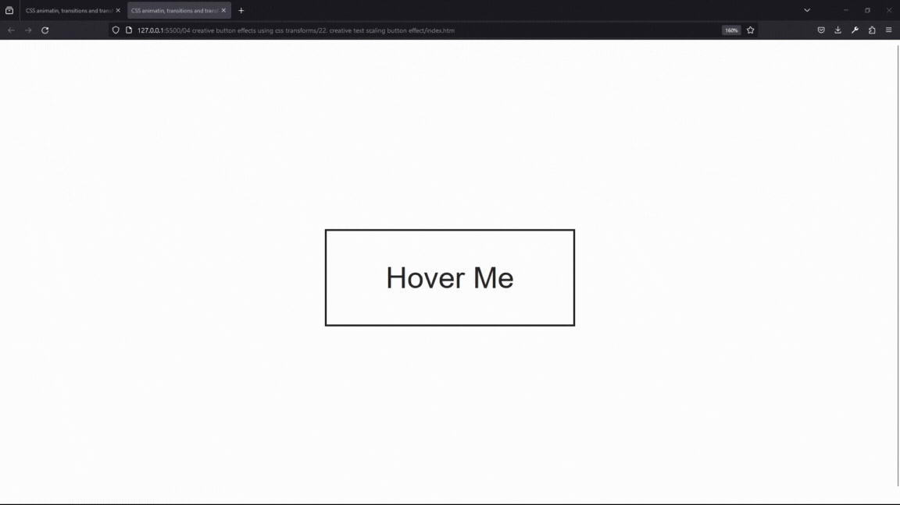

| Technology    | Description     |
| ------------- | --------------- |
| `Language`    | html, css       |
| `Framework`   | -               |
| `Library`     | -               |
| `Text editor` | Vs code         |
| `Browser`     | Chrome, firefox |

---

- In index.html

```html
<!DOCTYPE html>
<html lang="en-US">
  <head>
    <meta charset="UTF-8" />
    <meta name="viewport" content="width=device-width, initial-scale=1" />
    <title>CSS animatin, transitions and transforms</title>

    <!-- OUR STYLESHEET -->
    <link rel="stylesheet" href="style.css" type="text/css" media="all" />
  </head>

  <body>
    <a href="#">Hover Me</a>
  </body>
</html>
```

---

- In style.css

```css
body {
  height: 100vh;
  display: flex;
  justify-content: center;
  align-items: center;
}

a {
  text-decoration: none;
  color: #262626;
  font-family: sans-serif;
  font-size: 40px;
  border: 3px solid #262626;
  padding: 40px 80px;
  transition: all 0.5s;
  position: relative;
  overflow: hidden;
}

a:before {
  content: "Hover me";
  position: absolute;
  top: 0;
  left: 0;
  height: 100%;
  width: 100%;
  background-color: #262626;
  color: white;
  display: flex;
  justify-content: center;
  align-items: center;
  transform: scale(5);
  opacity: 0;
  transition: all 0.5s;
}

a:hover:before {
  transform: scale(1);
  opacity: 1;
}
```

<br>

### 23. creative circular swapping button effect<a id="23"></a>

> **_Business Objective: Layout_**

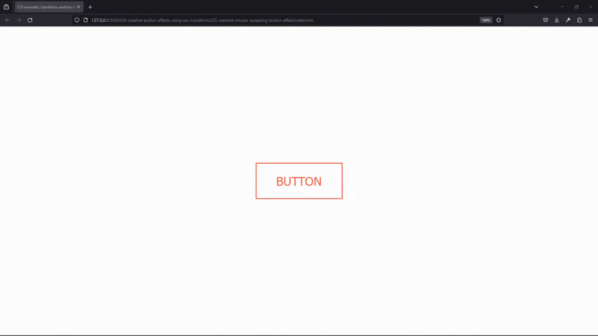

| Technology    | Description     |
| ------------- | --------------- |
| `Language`    | html, css       |
| `Framework`   | -               |
| `Library`     | -               |
| `Text editor` | Vs code         |
| `Browser`     | Chrome, firefox |

---

- In index.html

```html
<!DOCTYPE html>
<html lang="en-US">
  <head>
    <meta charset="UTF-8" />
    <meta name="viewport" content="width=device-width, initial-scale=1" />
    <title>CSS animatin, transitions and transforms</title>

    <!-- OUR STYLESHEET -->
    <link rel="stylesheet" href="style.css" type="text/css" media="all" />

    <!-- FONT ِAWESOME -->
    <link
      rel="stylesheet"
      href="https://use.fontawesome.com/releases/v5.4.2/css/all.css"
      integrity="sha384-/rXc/GQVaYpyDdyxK+ecHPVYJSN9bmVFBvjA/9eOB+pb3F2w2N6fc5qB9Ew5yIns"
      crossorigin="anonymous"
    />
  </head>

  <body>
    <button class="btn">button</button>
  </body>
</html>
```

---

- In style.css

```css
body {
  margin: 0;
  display: flex;
  align-items: center;
  justify-content: center;
  height: 100vh;
  font-family: sans-serif;
}

.btn {
  border: 2px solid tomato;
  background: none;
  color: tomato;
  padding: 20px 40px;
  font-size: 25px;
  text-transform: uppercase;
  cursor: pointer;
  transition: all 0.5s;
  position: relative;
  color: tomato;
  overflow: hidden;
}

.btn:hover {
  color: white;
}

.btn:before {
  content: "";
  position: absolute;
  bottom: 0;
  left: 0;
  width: 100%;
  height: 100%;
  background: tomato;
  z-index: -1;
  border-radius: 50% 50% 0% 0%;
  height: 0%;
  transition: all 0.5s;
}

.btn:hover:before {
  height: 190%;
}
```

<br>

### 24. creative rotating 3 layers button effect<a id="24"></a>

> **_Business Objective: Layout_**


| Technology    | Description     |
| ------------- | --------------- |
| `Language`    | html, css       |
| `Framework`   | -               |
| `Library`     | -               |
| `Text editor` | Vs code         |
| `Browser`     | Chrome, firefox |

---

- In index.html

```html
<!DOCTYPE html>
<html lang="en-US">
  <head>
    <meta charset="UTF-8" />
    <meta name="viewport" content="width=device-width, initial-scale=1" />
    <title>CSS animatin, transitions and transforms</title>

    <!-- OUR STYLESHEET -->
    <link rel="stylesheet" href="style.css" type="text/css" media="all" />
  </head>

  <body>
    <a href="#">Button</a>
  </body>
</html>
```

---

- In style.css

```css
body {
  margin: 0;
  display: flex;
  align-items: center;
  justify-content: center;
  height: 100vh;
  font-family: sans-serif;
  background-color: #212121;
}

a {
  padding: 20px 40px;
  text-transform: uppercase;
  text-decoration: none;
  background-color: #f1c40f;
  color: white;
  font-size: 20px;
  letter-spacing: 2px;
  position: relative;
}

a:before {
  content: "BUTTON";
  position: absolute;
  top: 0;
  left: 0;
  width: 100%;
  height: 100%;
  background-color: #2ecc71;
  display: flex;
  justify-content: center;
  align-items: center;
  transform: rotateX(270deg);
  transform-origin: top;
  transition: all 0.5s;
}

a:after {
  content: "BUTTON";
  position: absolute;
  top: 0;
  left: 0;
  width: 100%;
  height: 100%;
  background-color: red;
  display: flex;
  justify-content: center;
  align-items: center;
  transform-origin: bottom;
  transform: rotateX(270deg);
  transition: all 0.5s;
  transition-delay: 0.25s;
}

a:hover:before,
a:hover:after {
  transform: rotateX(0deg);
}
```

<br>

### 25. creative layers swapping from left to right button effect<a id="25"></a>

> **_Business Objective: Layout_**

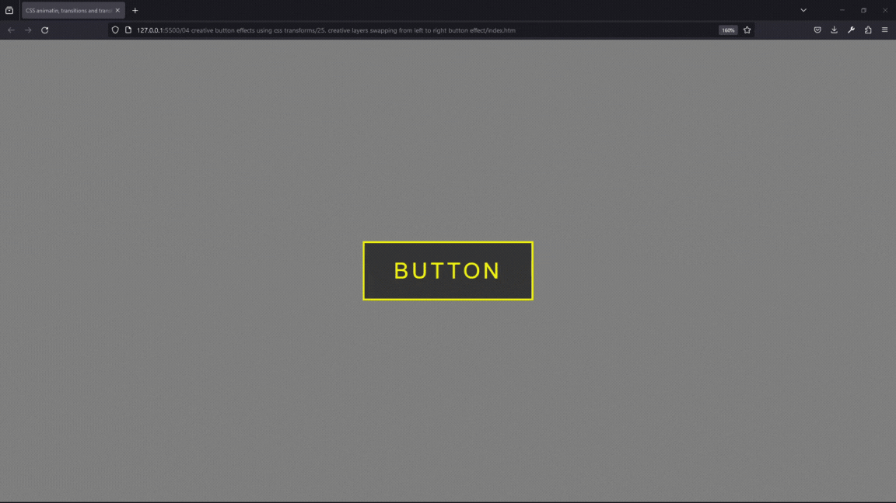

| Technology    | Description     |
| ------------- | --------------- |
| `Language`    | html, css       |
| `Framework`   | -               |
| `Library`     | -               |
| `Text editor` | Vs code         |
| `Browser`     | Chrome, firefox |

---

- In index.html

```html
<!DOCTYPE html>
<html lang="en-US">
  <head>
    <meta charset="UTF-8" />
    <meta name="viewport" content="width=device-width, initial-scale=1" />
    <title>CSS animatin, transitions and transforms</title>

    <!-- OUR STYLESHEET -->
    <link rel="stylesheet" href="style.css" type="text/css" media="all" />

    <!-- FONT ِAWESOME -->
    <link
      rel="stylesheet"
      href="https://use.fontawesome.com/releases/v5.4.2/css/all.css"
      integrity="sha384-/rXc/GQVaYpyDdyxK+ecHPVYJSN9bmVFBvjA/9eOB+pb3F2w2N6fc5qB9Ew5yIns"
      crossorigin="anonymous"
    />
  </head>

  <body>
    <a href="#">button</a>
  </body>
</html>
```

---

- In style.css

```css
body {
  margin: 0;
  display: flex;
  align-items: center;
  justify-content: center;
  height: 100vh;
  font-family: sans-serif;
  background-color: grey;
}

a {
  padding: 20px 40px;
  text-transform: uppercase;
  text-decoration: none;
  letter-spacing: 4px;
  color: transparent;
  border: 3px solid #ff0;
  font-size: 30px;
  position: relative;
}

a:before {
  content: "button";
  position: absolute;
  top: 0;
  left: 0;
  width: 100%;
  height: 100%;
  background-color: #363636;
  color: #ff0;
  display: flex;
  justify-content: center;
  align-items: center;
  transition: all 0.5s;
}

a:hover:before {
  left: 100%;
  transform: scale(0) rotateY(360deg);
  opacity: 0;
}

a:after {
  content: "button";
  position: absolute;
  top: 0;
  left: -100%;
  width: 100%;
  height: 100%;
  background-color: #363636;
  color: #ff0;
  display: flex;
  justify-content: center;
  align-items: center;
  transition: all 0.5s;
  transform: scale(0) rotateY(0deg);
  opacity: 0;
}

a:hover:after {
  left: 0;
  transform: scale(1) rotateY(360deg);
  opacity: 1;
}
```

<br>

### 26. creative 3 circles to background button effect<a id="26"></a>

> **_Business Objective: Layout_**

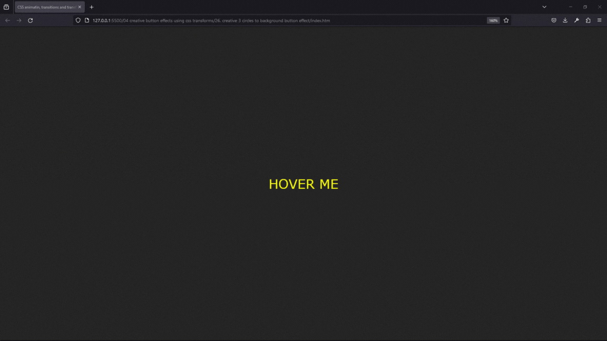

| Technology    | Description     |
| ------------- | --------------- |
| `Language`    | html, css       |
| `Framework`   | -               |
| `Library`     | -               |
| `Text editor` | Vs code         |
| `Browser`     | Chrome, firefox |

---

- In index.html

```html
<!DOCTYPE html>
<html lang="en-US">
  <head>
    <meta charset="UTF-8" />
    <meta name="viewport" content="width=device-width, initial-scale=1" />
    <title>CSS animatin, transitions and transforms</title>

    <!-- OUR STYLESHEET -->
    <link rel="stylesheet" href="style.css" type="text/css" media="all" />

    <!-- FONT ِAWESOME -->
    <link
      rel="stylesheet"
      href="https://use.fontawesome.com/releases/v5.4.2/css/all.css"
      integrity="sha384-/rXc/GQVaYpyDdyxK+ecHPVYJSN9bmVFBvjA/9eOB+pb3F2w2N6fc5qB9Ew5yIns"
      crossorigin="anonymous"
    />
  </head>

  <body>
    <a href="#"><span></span>hover me</a>
  </body>
</html>
```

---

- In style.css

```css
body {
  margin: 0;
  display: flex;
  align-items: center;
  justify-content: center;
  height: 100vh;
  font-family: verdana;
  background-color: #272727;
}

a {
  width: 220px;
  height: 80px;
  color: #ff0;
  background-color: transparent;
  font-size: 26px;
  text-decoration: none;
  text-transform: uppercase;
  text-align: center;
  line-height: 80px;
  transition: all 0.5s;
  position: relative;
}

a:before,
a:after {
  content: "";
  position: absolute;
  top: 50%;
  width: 20px;
  height: 20px;
  background-color: #ff0;
  border-radius: 50%;
  transform: translateY(-50%);
  transition: all 0.3s;
  z-index: -1;
  opacity: 0;
}

a:before {
  left: 0;
  box-shadow: -100px 0 0 #ff0;
}

a:after {
  right: 0;
  box-shadow: 100px 0 0 #ff0;
}

a:hover:before {
  left: 50%;
  box-shadow: 30px 0 0 #ff0;
  transform: translateX(-50%) translateY(-50%);
  opacity: 1;
}

a:hover:after {
  right: 50%;
  box-shadow: -30px 0 0 #ff0;
  transform: translateX(50%) translateY(-50%);
  opacity: 1;
}

span {
  position: absolute;
  top: 0;
  left: 0;
  width: 100%;
  height: 100%;
  background-color: #ff0;
  border-radius: 8px;
  transform: scale(0);
  transition: all 0.3s;
  z-index: -1;
}

a:hover span {
  transform: scale(1);
  transition-delay: 0.4s;
}

a:hover {
  color: #262626;
  transition-delay: 0.4s;
}
```

<br>

### 27. creative button hover effect<a id="27"></a>

> **_Business Objective: Layout_**

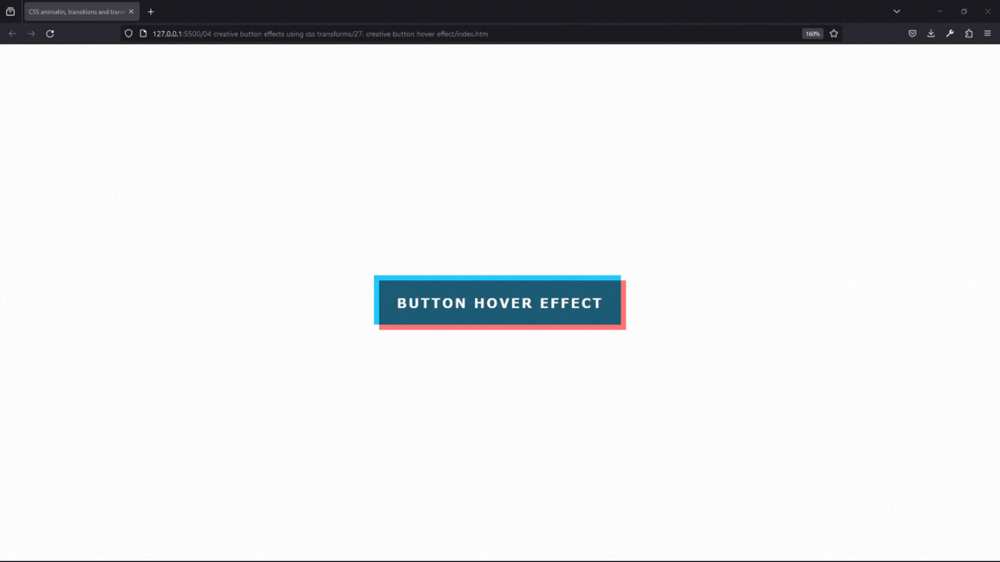

| Technology    | Description     |
| ------------- | --------------- |
| `Language`    | html, css       |
| `Framework`   | -               |
| `Library`     | -               |
| `Text editor` | Vs code         |
| `Browser`     | Chrome, firefox |

---

- In index.html

```html
<!DOCTYPE html>
<html lang="en-US">
  <head>
    <meta charset="UTF-8" />
    <meta name="viewport" content="width=device-width, initial-scale=1" />
    <title>CSS animatin, transitions and transforms</title>

    <!-- OUR STYLESHEET -->
    <link rel="stylesheet" href="style.css" type="text/css" media="all" />

    <!-- FONT ِAWESOME -->
    <link
      rel="stylesheet"
      href="https://use.fontawesome.com/releases/v5.4.2/css/all.css"
      integrity="sha384-/rXc/GQVaYpyDdyxK+ecHPVYJSN9bmVFBvjA/9eOB+pb3F2w2N6fc5qB9Ew5yIns"
      crossorigin="anonymous"
    />
  </head>

  <body>
    <a href="#">button hover effect</a>
  </body>
</html>
```

---

- In style.css

```css
body {
  margin: 0;
  display: flex;
  align-items: center;
  justify-content: center;
  height: 100vh;
  font-family: verdana;
}

a {
  width: 300px;
  height: 60px;
  text-decoration: none;
  text-transform: uppercase;
  background-color: transparent;
  text-align: center;
  line-height: 60px;
  font-weight: bold;
  letter-spacing: 2px;
  position: relative;
  transition: all 0.2s;
  color: white;
}

a:before {
  content: "";
  position: absolute;
  top: -3px;
  left: -3px;
  width: 100%;
  height: 100%;
  background-color: #20caff;
  z-index: -1;
  mix-blend-mode: multiply;
  transition: all 0.2s;
  transform-origin: top;
}

a:hover:before {
  top: -6px;
  left: 0;
  transform: perspective(1000px) rotateX(75deg);
}

a:after {
  content: "";
  position: absolute;
  top: 3px;
  left: 3px;
  width: 100%;
  height: 100%;
  background-color: #ff7675;
  z-index: -1;
  mix-blend-mode: multiply;
  transition: all 0.2s;
  transform-origin: bottom;
}

a:hover:after {
  top: 6px;
  left: 0;
  transform: perspective(1000px) rotateX(-75deg);
}

a:hover {
  color: #272727;
}
```

<br>

### 28. creative splitted button effect<a id="28"></a>

> **_Business Objective: Layout_**

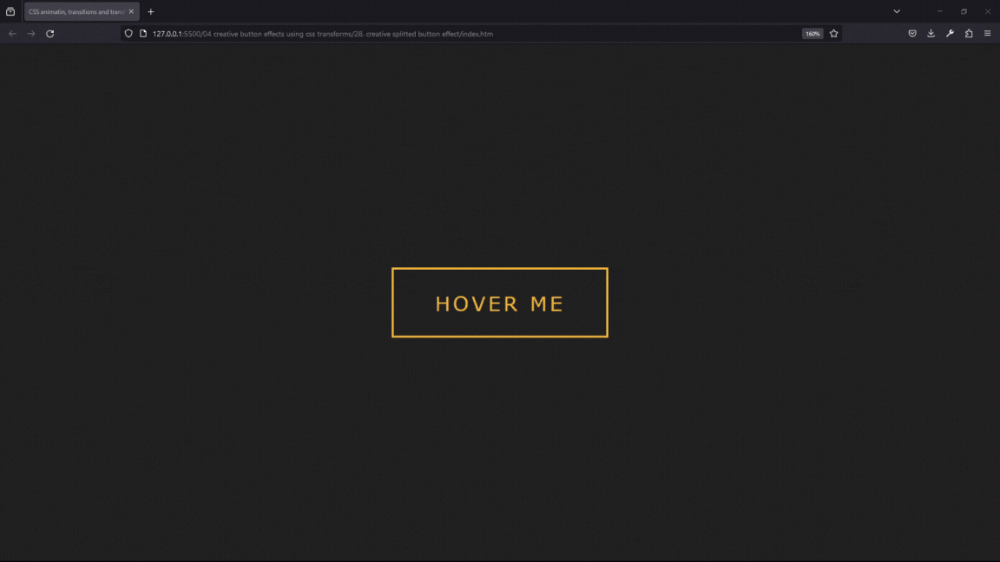

| Technology    | Description     |
| ------------- | --------------- |
| `Language`    | html, css       |
| `Framework`   | -               |
| `Library`     | -               |
| `Text editor` | Vs code         |
| `Browser`     | Chrome, firefox |

---

- In index.html

```html
<!DOCTYPE html>
<html lang="en-US">
  <head>
    <meta charset="UTF-8" />
    <meta name="viewport" content="width=device-width, initial-scale=1" />
    <title>CSS animatin, transitions and transforms</title>

    <!-- OUR STYLESHEET -->
    <link rel="stylesheet" href="style.css" type="text/css" media="all" />

    <!-- FONT ِAWESOME -->
    <link
      rel="stylesheet"
      href="https://use.fontawesome.com/releases/v5.4.2/css/all.css"
      integrity="sha384-/rXc/GQVaYpyDdyxK+ecHPVYJSN9bmVFBvjA/9eOB+pb3F2w2N6fc5qB9Ew5yIns"
      crossorigin="anonymous"
    />
  </head>

  <body>
    <a href="#"><span>hover me</span></a>
  </body>
</html>
```

---

- In style.css

```css
body {
  margin: 0;
  display: flex;
  align-items: center;
  justify-content: center;
  height: 100vh;
  background-color: #222;
}

a {
  text-decoration: none;
  text-transform: uppercase;
  font-size: 25px;
  font-family: verdana;
  color: #f6b93b;
  letter-spacing: 3px;
  padding: 25px 50px;
  position: relative;
  border: 3px solid #f6b93b;
  transition: all 0.2s;
  overflow: hidden;
}

a:before,
a:after,
span:before,
span:after {
  content: "";
  position: absolute;
  width: 25%;
  height: 100%;
  background-color: #f6b93b;
  z-index: -1;
  transition: all 0.1s;
}

a:before {
  top: 100%;
  left: 0%;
}

a:hover:before {
  top: 0;
  left: 0;
}

a:after {
  top: -100%;
  right: 0;
  transition-delay: 0.3s;
}

a:hover:after {
  top: 0;
  right: 0;
}

a span:before {
  top: -100%;
  left: 25%;
  transition-delay: 0.1s;
}

a:hover span:before {
  top: 0;
  left: 25%;
}

a span:after {
  bottom: -100%;
  right: 25%;
  transition-delay: 0.2s;
}

a:hover span:after {
  bottom: 0;
  right: 25%;
}

a:hover {
  color: #222;
}
```

<br>

### 29. creative border swapping button effect<a id="29"></a>

> **_Business Objective: Layout_**


| Technology    | Description     |
| ------------- | --------------- |
| `Language`    | html, css       |
| `Framework`   | -               |
| `Library`     | -               |
| `Text editor` | Vs code         |
| `Browser`     | Chrome, firefox |

---

- In index.html

```html
<!DOCTYPE html>
<html lang="en-US">
  <head>
    <meta charset="UTF-8" />
    <meta name="viewport" content="width=device-width, initial-scale=1" />
    <title>CSS animatin, transitions and transforms</title>

    <!-- OUR STYLESHEET -->
    <link rel="stylesheet" href="style.css" type="text/css" media="all" />
  </head>

  <body>
    <a href="#">hover me</a>
  </body>
</html>
```

---

- In style.css

```css
body {
  margin: 0;
  display: flex;
  align-items: center;
  justify-content: center;
  height: 100vh;
  background-color: #212121;
}

a {
  text-decoration: none;
  text-transform: uppercase;
  font-size: 22px;
  font-family: verdana;
  letter-spacing: 3px;
  height: 60px;
  width: 200px;
  line-height: 60px;
  text-align: center;
  color: #fdc518;
  position: relative;
}

a:before {
  content: "";
  position: absolute;
  height: 90px;
  width: 200px;
  top: -15px;
  left: 0;
  border-left: 2px solid red;
  border-right: 2px solid #fdc518;
  transition: all 01s;
}

a:after {
  content: "";
  position: absolute;
  height: 60px;
  width: 230px;
  top: 0;
  left: -15px;
  border-top: 2px solid red;
  border-bottom: 2px solid #fdc518;
  transition: all 1s;
}

a:hover:before {
  transform: rotateY(180deg);
}

a:hover:after {
  transform: rotateX(180deg);
}
```

<br>

### 30. creative border growing button effect<a id="30"></a>

> **_Business Objective: Layout_**


| Technology    | Description     |
| ------------- | --------------- |
| `Language`    | html, css       |
| `Framework`   | -               |
| `Library`     | -               |
| `Text editor` | Vs code         |
| `Browser`     | Chrome, firefox |

---

- In index.html

```html
<!DOCTYPE html>
<html lang="en-US">

<head>
    <meta charset="UTF-8">
    <meta name="viewport" content="width=device-width, initial-scale=1">
    <title>CSS animatin, transitions and transforms</title>

    <!-- OUR STYLESHEET -->
    <link rel="stylesheet" href="style.css" type="text/css" media="all">

</head>

<body>

	<button>
		<span>/<span>
		submit</button>

</body>
</html>

```

---

- In style.css

```css
@import url(https://fonts.googleapis.com/css?family=BenchNine:700);

body {
  margin: 0;
  height: 100vh;
  display: flex;
  align-items: center;
  justify-content: center;
  background-color: #272727;
}

button {
  border: none;
  padding: 12px 40px;
  background-color: #c47135;
  color: white;
  font-family: "BenchNine";
  font-size: 22px;
  text-transform: uppercase;
  cursor: pointer;
  position: relative;
}

button:before {
  content: "";
  position: absolute;
  width: 24px;
  height: 24px;
  top: -5px;
  left: -5px;
  border-top: 2px solid #c47135;
  border-left: 2px solid #c47135;
  transition: all 0.25s;
}

button:hover:before,
button:hover:after {
  height: 100%;
  width: 100%;
}

button:after {
  content: "";
  position: absolute;
  width: 24px;
  height: 24px;
  bottom: -5px;
  right: -5px;
  border-bottom: 2px solid #c47135;
  border-right: 2px solid #c47135;
  transition: all 0.25s;
}
```

<br>

### 31. creative first letter rotating button effect<a id="31"></a>

> **_Business Objective: Layout_**


| Technology    | Description     |
| ------------- | --------------- |
| `Language`    | html, css       |
| `Framework`   | -               |
| `Library`     | -               |
| `Text editor` | Vs code         |
| `Browser`     | Chrome, firefox |

---

- In index.html

```html

```

---

- In style.css

```css

```

<br>

### 32. creative 4 borders growing button effect<a id="32"></a>

> **_Business Objective: Layout_**

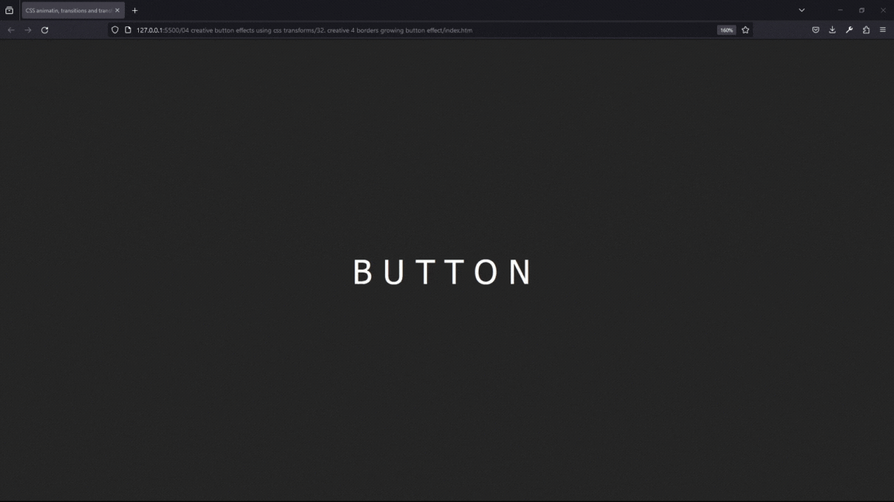

| Technology    | Description     |
| ------------- | --------------- |
| `Language`    | html, css       |
| `Framework`   | -               |
| `Library`     | -               |
| `Text editor` | Vs code         |
| `Browser`     | Chrome, firefox |

---

- In index.html

```html
<!DOCTYPE html>
<html lang="en-US">
  <head>
    <meta charset="UTF-8" />
    <meta name="viewport" content="width=device-width, initial-scale=1" />
    <title>CSS animatin, transitions and transforms</title>

    <!-- OUR STYLESHEET -->
    <link rel="stylesheet" href="style.css" type="text/css" media="all" />
  </head>

  <body>
    <a href="#"><span>B</span>utton</a>
  </body>
</html>
```

---

- In style.css

```css
body {
  height: 100vh;
  display: flex;
  justify-content: center;
  align-items: center;
  font-family: sans-serif;
  overflow: hidden;
}

a {
  text-decoration: none;
  width: 160px;
  height: 60px;
  color: black;
  border: 2px solid black;
  text-align: center;
  line-height: 60px;
  font-size: 25px;
  position: relative;
  transition: all 0.2s;
}
a:hover {
  color: white;
}

a:before {
  content: "";
  position: absolute;
  top: 0;
  left: 0;
  width: 100%;
  height: 100%;
  background-color: black;
  z-index: -1;
  opacity: 0;
  transition: all 0.8s;
}

a:hover:before {
  opacity: 1;
  transform: rotate(15deg);
}

a span {
  color: transparent;
  position: relative;
}

a span:before {
  content: "B";
  position: absolute;
  color: black;
  transition: all 0.2s;
}

a:hover span:before {
  color: white;
  font-size: 80px;
  transform: translate(-65%, -10%) rotate(360deg);
}
```

<br>

### 33. creative wavy button effect<a id="33"></a>

> **_Business Objective: Layout_**

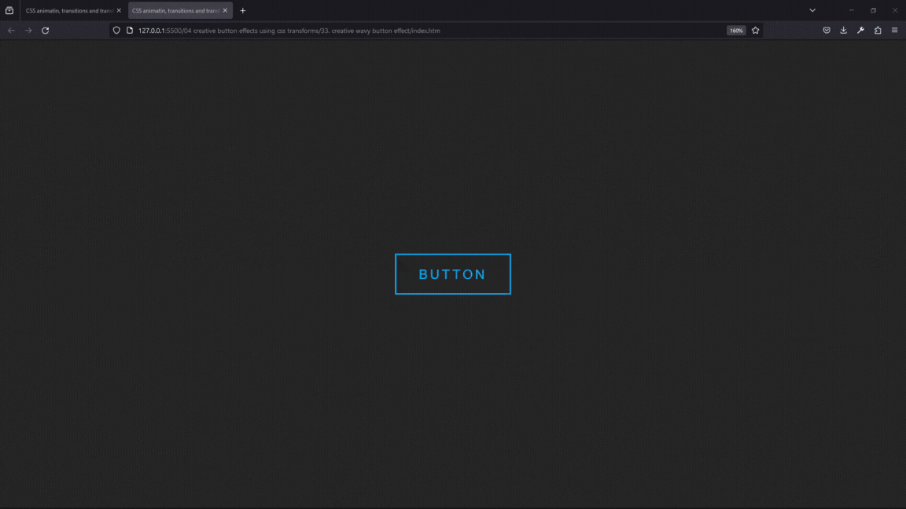

| Technology    | Description     |
| ------------- | --------------- |
| `Language`    | html, css       |
| `Framework`   | -               |
| `Library`     | -               |
| `Text editor` | Vs code         |
| `Browser`     | Chrome, firefox |

---

- In index.html

```html
<!DOCTYPE html>
<html lang="en-US">
  <head>
    <meta charset="UTF-8" />
    <meta name="viewport" content="width=device-width, initial-scale=1" />
    <title>CSS animatin, transitions and transforms</title>

    <!-- OUR STYLESHEET -->
    <link rel="stylesheet" href="style.css" type="text/css" media="all" />

    <!-- FONT ِAWESOME -->
    <link
      rel="stylesheet"
      href="https://use.fontawesome.com/releases/v5.4.2/css/all.css"
      integrity="sha384-/rXc/GQVaYpyDdyxK+ecHPVYJSN9bmVFBvjA/9eOB+pb3F2w2N6fc5qB9Ew5yIns"
      crossorigin="anonymous"
    />
  </head>

  <body>
    <button>
      button
      <span></span>
    </button>
  </body>
</html>
```

---

- In style.css

```css
body {
  margin: 0;
  display: flex;
  align-items: center;
  justify-content: center;
  height: 100vh;
  font-family: sans-serif;
  background-color: #272727;
}

a {
  text-decoration: none;
  padding: 15px 30px;
  color: #00aeff;
  font-size: 18px;
  letter-spacing: 3px;
  border: 2px solid #00aeff;
  text-transform: uppercase;
  position: relative;
  overflow: hidden;
  transition: all 0.5s;
}

a:hover {
  color: white;
}

.wave {
  position: absolute;
  width: 100%;
  height: 100%;
  left: 0;
  top: calc(100% + 22px);
  background-color: #00aeff;
  transition: all 1s;
  z-index: -1;
}

a:hover .wave {
  top: 0;
}

.wave:before {
  content: "";
  position: absolute;
  top: -22px;
  left: 0;
  width: 100%;
  height: 22px;
  background: url(wave.png);
  animation: wavy 0.5s linear infinite;
}

@keyframes wavy {
  0% {
    background-position-x: 0;
  }
  100% {
    background-position-x: 118px;
  }
}
```

### 34. creative 2 cuts button effect<a id="34"></a>

> **_Business Objective: Layout_**

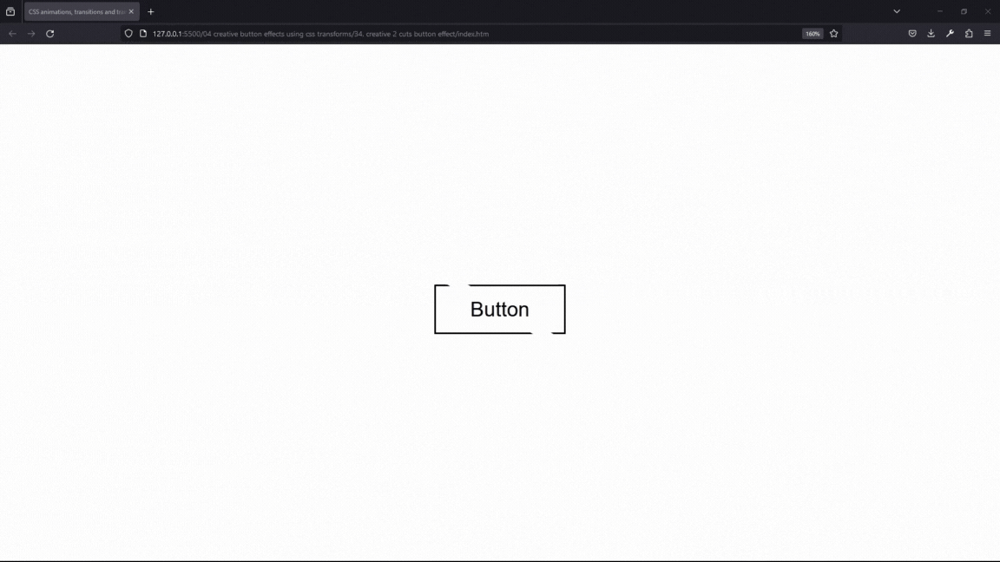

| Technology    | Description     |
| ------------- | --------------- |
| `Language`    | html, css       |
| `Framework`   | -               |
| `Library`     | -               |
| `Text editor` | Vs code         |
| `Browser`     | Chrome, firefox |

---

- In index.html

```html
<!DOCTYPE html>
<html lang="en-US">
  <head>
    <meta charset="UTF-8" />
    <meta name="viewport" content="width=device-width, initial-scale=1" />
    <title>CSS animations, transitions and transforms</title>

    <!-- OUR STYLESHEET -->
    <link rel="stylesheet" href="style.css" type="text/css" media="all" />
  </head>

  <body>
    <a href="#">
      button
      <span></span>
    </a>
  </body>
</html>
```

---

- In style.css

```css
* {
  box-sizing: border-box;
}

body {
  height: 100vh;
  display: flex;
  justify-content: center;
  align-items: center;
  font-family: sans-serif;
  overflow: hidden;
}

a {
  text-decoration: none;
  width: 160px;
  height: 60px;
  color: black;
  line-height: 60px;
  text-align: center;
  text-transform: capitalize;
  font-size: 25px;
  position: relative;
  transition: all 0.2s;
  overflow: hidden;
}

a span {
  position: absolute;
  width: 100%;
  height: 100%;
  top: 0;
  left: 0;
  background-color: transparent;
  border: 2px solid black;
  z-index: -1;
}

span:before {
  content: "";
  position: absolute;
  width: 8%;
  height: 500%;
  background-color: white;
  top: 50%;
  left: 50%;
  transition: all 0.2s;
  transform: translate(-50%, -50%) rotate(-60deg);
}

a:hover span:before {
  width: 100%;
  background-color: black;
  transform: translate(-50%, -50%) rotate(60deg);
}

a:hover {
  color: white;
}
```

<br>

### 35. creative 2 parts skewed button effect<a id="35"></a>

> **_Business Objective: Layout_**

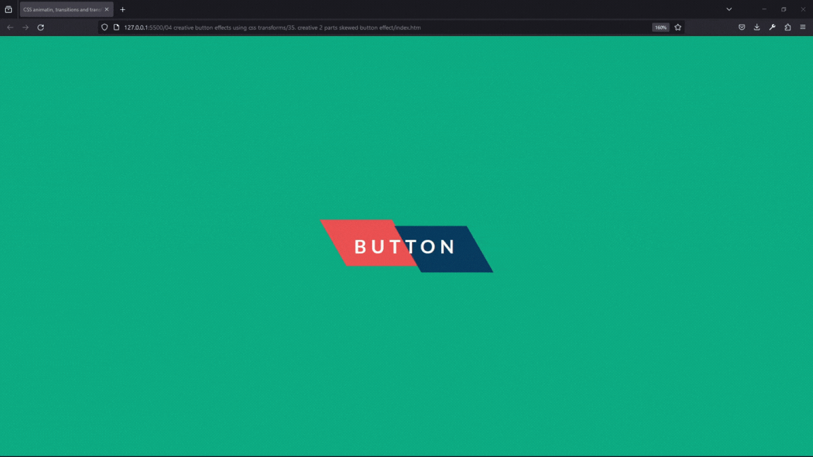

| Technology    | Description     |
| ------------- | --------------- |
| `Language`    | html, css       |
| `Framework`   | -               |
| `Library`     | -               |
| `Text editor` | Vs code         |
| `Browser`     | Chrome, firefox |

---

- In index.html

```html
<!DOCTYPE html>
<html lang="en-US">
  <head>
    <meta charset="UTF-8" />
    <meta name="viewport" content="width=device-width, initial-scale=1" />
    <title>CSS animatin, transitions and transforms</title>

    <!-- OUR STYLESHEET -->
    <link rel="stylesheet" href="style.css" type="text/css" media="all" />
  </head>

  <body>
    <a href="#">button</a>
  </body>
</html>
```

---

- In style.css

```css
body {
  height: 100vh;
  margin: 0;
  display: flex;
  justify-content: center;
  align-items: center;
  font-family: "Lato", sans-serif;
  background-color: #10ac84;
}

a {
  text-transform: uppercase;
  text-decoration: none;
  font-weight: 700;
  position: relative;
  letter-spacing: 7px;
  padding: 18px 30px;
  background: transparent;
  font-size: 28px;
  color: white;
}

a:before {
  content: "";
  position: absolute;
  height: 100%;
  width: 50%;
  left: -1%;
  top: -5px;
  background-color: #ee5253;
  transform: skewX(30deg);
  z-index: -1;
  transition: all 0.3s cubic-bezier(0.68, -0.55, 0.265, 1.55);
}

a:hover:before {
  transform: skewX(0deg);
  left: 50%;
  top: 0;
}

a:after {
  content: "";
  position: absolute;
  height: 100%;
  width: 50%;
  left: 51%;
  top: 5px;
  background-color: #0a3d62;
  transform: skewX(30deg);
  z-index: -1;
  transition: all 0.3s cubic-bezier(0.68, -0.55, 0.265, 1.55);
}

a:hover:after {
  transform: skewX(0deg);
  left: 0%;
  top: 0;
}
```

<br>

### 36. creative pulsing button effect<a id="36"></a>

> **_Business Objective: Layout_**


| Technology    | Description     |
| ------------- | --------------- |
| `Language`    | html, css       |
| `Framework`   | -               |
| `Library`     | -               |
| `Text editor` | Vs code         |
| `Browser`     | Chrome, firefox |

---

- In index.html

```html
<!DOCTYPE html>
<html lang="en-US">
  <head>
    <meta charset="UTF-8" />
    <meta name="viewport" content="width=device-width, initial-scale=1" />
    <title>CSS animatin, transitions and transforms</title>

    <!-- OUR STYLESHEET -->
    <link rel="stylesheet" href="style.css" type="text/css" media="all" />
  </head>

  <body>
    <a href="#">hover me</a>
  </body>
</html>
```

---

- In style.css

```css
body {
  height: 100vh;
  margin: 0;
  display: flex;
  justify-content: center;
  align-items: center;
  font-family: "Lato", sans-serif;
  background-color: #10ac84;
  font-weight: bold;
  position: relative;
}

a {
  position: absolute;
  text-decoration: none;
  text-transform: uppercase;
  padding: 25px 50px;
  background-color: white;
  color: #777;
  border-radius: 100px;
  font-size: 24px;
  transition: all 0.2s;
}

a:before {
  content: "";
  position: absolute;
  top: 0;
  left: 0;
  width: 100%;
  height: 100%;
  background-color: white;
  border-radius: 100px;
  transition: all 0.4s;
  z-index: -1;
}

a:hover:before {
  transform: scaleX(1.4) scaleY(1.6);
  opacity: 0;
}

a:hover {
  transform: translateY(-3px);
  box-shadow: 0 10px 20px rgba(0, 0, 0, 0.2);
}

a:active {
  transform: translateY(-1px);
  box-shadow: 0 5px 10px rgba(0, 0, 0, 0.2);
}
```

<br>

### 37. diagonal swipe button effect using borders<a id="37"></a>

> **_Business Objective: Layout_**


| Technology    | Description     |
| ------------- | --------------- |
| `Language`    | html, css       |
| `Framework`   | -               |
| `Library`     | -               |
| `Text editor` | Vs code         |
| `Browser`     | Chrome, firefox |

---

- In index.html

```html
<!DOCTYPE html>
<html lang="en-US">
  <head>
    <meta charset="UTF-8" />
    <meta name="viewport" content="width=device-width, initial-scale=1" />
    <title>CSS animatin, transitions and transforms</title>

    <!-- OUR STYLESHEET -->
    <link rel="stylesheet" href="style.css" type="text/css" media="all" />
  </head>

  <body>
    <a href="#">button</a>
  </body>
</html>
```

---

- In style.css

```css
@import url("https://fonts.googleapis.com/css?family=Fjalla+One");

body {
  height: 100vh;
  margin: 0;
  display: flex;
  justify-content: center;
  align-items: center;
  font-weight: bold;
  font-family: "Lucida Sans", "Lucida Sans Regular", "Lucida Grande",
    "Lucida Sans Unicode", Geneva, Verdana, sans-serif;
}

a {
  text-decoration: none;
  position: relative;
  width: 250px;
  height: 80px;
  text-align: center;
  line-height: 80px;
  color: #250e74;
  border: 4px solid #250e74;
  font-size: 24px;
  letter-spacing: 3px;
  text-transform: uppercase;
  transition: all 0.5s;
  overflow: hidden;
}

a:before {
  content: "";
  position: absolute;
  top: 0;
  left: 0;
  bottom: 0;
  right: 0;
  border-top: 40px solid #250e74;
  border-bottom: 40px solid #250e74;
  border-right: 40px solid transparent;
  transition: all 0.5s;
  z-index: -1;
  transform: translateX(-100%);
}

a:hover:before {
  transform: translateX(0%);
}

a:after {
  content: "";
  position: absolute;
  top: 0;
  left: 0;
  bottom: 0;
  right: 0;
  border-top: 40px solid #250e74;
  border-bottom: 40px solid #250e74;
  border-left: 40px solid transparent;
  transition: all 0.5s;
  z-index: -1;
  transform: translateX(100%);
}

a:hover:after {
  transform: translateX(0%);
}

a:hover {
  color: white;
}
```

<br>

### 38. Creative 4 Lines Button Hover Effect<a id="38"></a>

> **_Business Objective: Layout_**


| Technology    | Description     |
| ------------- | --------------- |
| `Language`    | html, css       |
| `Framework`   | -               |
| `Library`     | -               |
| `Text editor` | Vs code         |
| `Browser`     | Chrome, firefox |

---

- In index.html

```html
<!DOCTYPE html>
<html>
  <head>
    <title>Button Hover Effects</title>
    <link rel="stylesheet" type="text/css" href="style.css" />
  </head>
  <body>
    <div class="container">
      <a href="#">
        <span></span>
        <span></span>
        <span></span>
        <span></span>
        Button
      </a>
      <a href="#">
        <span></span>
        <span></span>
        <span></span>
        <span></span>
        Button
      </a>
    </div>
  </body>
</html>
```

---

- In style.css

```css
* {
  margin: 0;
  padding: 0;
  box-sizing: border-box;
  font-family: sans-serif;
}

body {
  display: flex;
  justify-content: center;
  align-items: center;
  min-height: 100vh;
  background: #222;
}

.container {
  display: flex;
  gap: 150px;
  flex-wrap: wrap;
}

a {
  position: relative;
  text-decoration: none;
  text-transform: uppercase;
  padding: 20px 35px;
  border: 2px solid #1e9bff;
  color: #1e9bff;
  font-size: 20px;
  letter-spacing: 4px;
  transition: 0.5s;
}

a:hover {
  color: #fff;
  border: 2px solid transparent;
}

span {
  position: absolute;
  background: #1e9bff;
  box-shadow: 0 0 10px #1e9bff, 0 0 20px #1e9bff, 0 0 30px #1e9bff, 0 0 50px
      #1e9bff, 0 0 100px #1e9bff;
}

span:nth-child(1),
span:nth-child(3) {
  width: 40px;
  height: 4px;
}

span:nth-child(2),
span:nth-child(4) {
  width: 4px;
  height: 40px;
}

span:nth-child(1) {
  top: calc(50% - 2px);
  left: -50px;
  transition: 0.5s ease-in-out;
  transform-origin: left;
  transition-delay: 0.25s;
}

a:hover span:nth-child(1) {
  left: 50%;
  transform: scaleX(0);
  transition-delay: 0s;
}

span:nth-child(3) {
  top: calc(50% - 2px);
  right: -50px;
  transition: 0.5s ease-in-out;
  transform-origin: right;
  transition-delay: 0.25s;
}

a:hover span:nth-child(3) {
  right: 50%;
  transform: scaleX(0);
  transition-delay: 0s;
}

span:nth-child(2) {
  left: calc(50% - 2px);
  top: -50px;
  transition: 0.5s ease-in-out;
  transform-origin: top;
  transition-delay: 0.25s;
}

a:hover span:nth-child(2) {
  top: 50%;
  transform: scaleY(0);
  transition-delay: 0s;
}

span:nth-child(4) {
  left: calc(50% - 2px);
  bottom: -50px;
  transition: 0.5s ease-in-out;
  transform-origin: bottom;
  transition-delay: 0.25s;
}

a:hover span:nth-child(4) {
  bottom: 50%;
  transform: scaleY(0);
  transition-delay: 0s;
}

a:before {
  content: "";
  position: absolute;
  top: 0;
  left: 0;
  width: 100%;
  height: 100%;
  background: #1e9bff;
  transform: scale(0);
  transition: 0.5s;
  z-index: -1;
}

a:hover:before {
  transform: scale(1);
  transition-delay: 0.5s;
  box-shadow: 0 0 10px #1e9bff, 0 0 30px #1e9bff, 0 0 60px #1e9bff;
}
```

<br>
